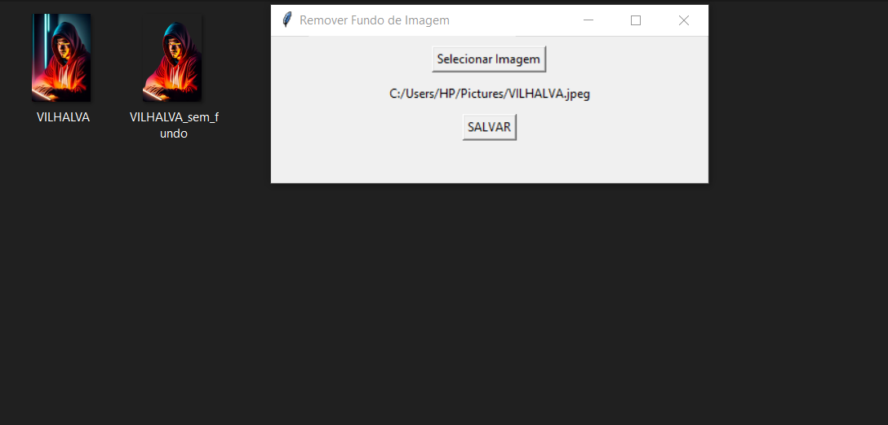

# REMOVEDOR DE FUNDO DE IMAGEM
🎈USE ESSE APP PARA REMOVER O FUNDO DAS SUAS FOTOS.

  

## DESCRIÇÃO:
Este aplicativo em Tkinter é um utilitário simples para remover o fundo de uma imagem selecionada pelo usuário e salvar a imagem resultante no mesmo diretório da imagem original. Ele consiste em uma interface gráfica que permite ao usuário selecionar uma imagem de seu sistema de arquivos e, em seguida, remove o fundo do mesma selecionada quando o usuário clica no botão "SALVAR".

## CARACTERISTICAS:
1. **Seleção de Imagem**: O usuário pode selecionar uma imagem clicando no botão "SELECIONAR". Isso abrirá uma caixa de diálogo para selecionar o arquivo de imagem desejado.

2. **Remoção de Fundo**: Após selecionar a imagem, o caminho do arquivo selecionado é exibido na interface. O botão "SALVAR" é ativado, permitindo ao usuário remover o fundo da imagem clicando neste botão.

3. **Salvar Imagem**: Quando o usuário clica no botão "SALVAR", o aplicativo remove o fundo da imagem selecionada e salva a nova imagem (sem fundo) no mesmo diretório da imagem original, com um sufixo "_SEM_FUNDO.png" adicionado ao nome do arquivo.

4. **Feedback ao Usuário**: Após a remoção do fundo e a salvamento da imagem, uma mensagem de sucesso é exibida ao usuário informando que o fundo foi removido e a imagem foi salva com sucesso.

5. **Interface Simples**: A interface é limpa e intuitiva, contendo apenas os elementos necessários para selecionar uma imagem e realizar a remoção do fundo.

Este aplicativo é útil para usuários que desejam remover o fundo de suas imagens de forma rápida e fácil, sem a necessidade de utilizar softwares mais complexos de edição de imagem.

## SAIBA MAIS:
- [PROJETO CRIADO PELO VILHALVA](https://github.com/VILHALVA)
- [FAÇA OS NOSSOS CURSOS](https://github.com/VILHALVA?tab=repositories&q=+topic:CURSO)

